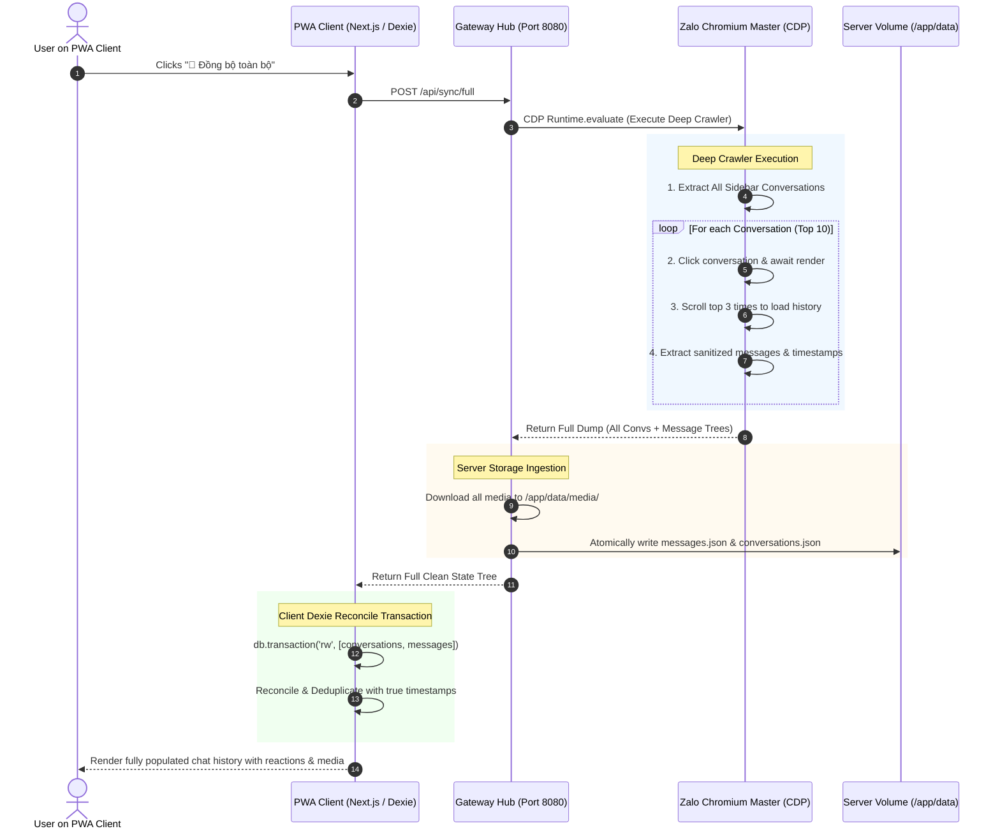

# Comprehensive Remediation Plan: Message Normalization & Full-Data Synchronization Pipeline

**Target System:** Universal Zalo Multi-Device Gateway & PWA Client  
**Author:** Principal Full-Stack Engineer & Protocol Specialist  
**Status:** PROPOSED & READY FOR IMPLEMENTATION  
**Document Version:** 1.0.0  

---

## 1. Executive Summary & Root-Cause Diagnosis

An exhaustive architectural audit of the Universal Zalo codebase revealed three critical defects in the message parsing and synchronization pipeline:

```
[ Zalo Web (Chromium Master) ]
              │
              ▼  (1) DOM Scraper grabs innerText of reaction containers & emoticons
[ Gateway Hub / Scraping Engine ] ──► Corrupted text: "Hello/-strong/-heart:>:o:-((:-h"
              │
              ▼  (2) Ingestion stamps Date.now() instead of real msg_time / data-time
[ Server Storage (/app/data) ] ────► All messages clump into identical timestamps
              │
              ▼  (3) "Đồng bộ" only triggers shallow click, no IDB or scroll dump
[ Web Client (Dexie IndexedDB) ] ──► Partial data, missing history, broken ordering
```

---

## 2. Root-Cause Analysis by Defect

### 2.1 Defect 1: Raw Reaction/Emotion String Leaks
* **Symptom:** Messages in the database and PWA UI show corrupted suffixes such as `/-strong/-heart:>:o:-((:-h`, `:>:o:-((`, `:-h`, `:-bd`.
* **Root Cause in `services/gateway-hub/src/index.ts` (lines 255–275):**
  1. The scraper selects `.bubble-content, .content, .text` and immediately calls `.textContent.trim()`.
  2. In Zalo Web, the reaction pill containers (`.react-container`, `.react-list`, `.reaction-icon-holder`) and legacy emoticons are rendered as DOM children inside the message card. Taking `textContent` on the parent node concatenates the inner text of these reaction elements directly onto the message body.
  3. No regex/AST sanitizer exists to separate trailing reaction tokens from legitimate user text or map them to structured reaction records (`{ type: "HEART", count: 1 }`).

### 2.2 Defect 2: Timestamp & State Clumping
* **Symptom:** All synced historical messages appear with the exact same timestamp (e.g. `21:00`), destroying conversation chronology, date separators, and sort order.
* **Root Cause in `services/gateway-hub/src/index.ts` (line 297):**
  1. Historical messages are ingested with `timestamp: Date.now()`.
  2. The parser fails to parse the DOM timestamp elements (`.card-time`, `data-time`, `data-ts`, or `.chat-date` headers) or query Zalo's underlying Chromium IndexedDB (`zalo_chat_...` / `zaloDB`) which contains the authoritative Unix millisecond timestamps (`msg_time`).

### 2.3 Defect 3: Shallow vs. Deep Sync Mismatch
* **Symptom:** Clicking "Đồng bộ" only pulls the few messages currently visible in the active DOM viewport (5–10 messages), ignoring other conversations, historical scroll buffers, contact avatars, and unread badges.
* **Root Cause:**
  1. The sync action only clicks the Zalo Web UI sync button via CDP, but does not perform a structured Master state extraction across all conversations.
  2. No scroll buffer hydration (scrolling `.message-view-scroll` to top to trigger Zalo Web's virtual list pagination).
  3. The Web Client's local Dexie database lacks an atomic reconciliation transaction (`POST /api/sync/full`) to clear stale corrupted entries and replace them with verified server state.

---

## 3. Architecture & Sanitization Design

### 3.1 Zalo Emoticon & Reaction Lexer / AST Sanitizer

Zalo uses a well-defined set of legacy emoticon and reaction tokens:

| Token | Legacy Code | Reaction Type | Unicode / Display |
| :--- | :--- | :--- | :--- |
| **Like / Thích** | `/-strong`, `(y)` | `LIKE` | 👍 |
| **Heart / Tim** | `/-heart`, `<3` | `HEART` | ❤️ |
| **Dislike** | `/-fade` | `DISLIKE` | 👎 |
| **Haha / Cười** | `:-bd`, `:-D`, `:D` | `HAHA` | 😆 |
| **Cry / Buồn khóc**| `:>:o:-((`, `:-((`, `:-(` | `CRY` | 😭 |
| **Angry / Phẫn nộ**| `:-<`, `:@` | `ANGRY` | 😡 |
| **Wave / Chào** | `:-h` | `EMOTION` | 👋 |
| **Kiss / Hôn** | `:-*` | `EMOTION` | 😘 |
| **Surprise / Wow** | `:-O`, `:-o` | `WOW` | 😲 |
| **Sweat / Lo lắng** | `:-S`, `:-s` | `EMOTION` | 😰 |
| **Thinking** | `:-?` | `EMOTION` | 🤔 |

#### AST Sanitizer Algorithm:
1. **DOM Pre-cleaning (Browser Scraper Level):**
   ```javascript
   // Clone node to avoid mutating live DOM
   const clone = el.cloneNode(true);
   // Remove all reaction, quote, time, and tooltip sub-nodes
   const pruneSelectors = [
     '.react-container', '.react-list', '.react-total', '.reaction-list',
     '.card-time', '.time', '.quote-content', '.reply-container',
     '.extra-content', 'button', '.dropdown'
   ];
   clone.querySelectorAll(pruneSelectors.join(',')).forEach(n => n.remove());
   ```
2. **Trailing Reaction Token Parser (Server Normalizer Level):**
   ```typescript
   export interface ParsedReaction {
     code: string;
     type: "LIKE" | "HEART" | "DISLIKE" | "HAHA" | "CRY" | "ANGRY" | "WOW";
     emoji: string;
     count: number;
   }

   const REACTION_MAP: Record<string, { type: ParsedReaction["type"]; emoji: string }> = {
     "/-strong": { type: "LIKE", emoji: "👍" },
     "/-heart": { type: "HEART", emoji: "❤️" },
     "/-fade": { type: "DISLIKE", emoji: "👎" },
     ":-bd": { type: "HAHA", emoji: "😆" },
     ":>:o:-(( ": { type: "CRY", emoji: "😭" },
     ":>:o:-(( ": { type: "CRY", emoji: "😭" },
     ":-(( ": { type: "CRY", emoji: "😢" },
     ":-<": { type: "ANGRY", emoji: "😡" },
     ":-O": { type: "WOW", emoji: "😲" },
   };

   // Regex recognizing trailing reaction bursts
   const REACTION_BURST_REGEX = /(?:\/-(?:strong|heart|fade|break|rose)|:[-<()DOPSbdh*?]|:>:o:-\(\()+$/g;
   ```

---

### 3.2 Deep Timestamp Extraction & Chronology Preservation

To prevent timestamp clumping, the extractor implements a 3-tier fallback strategy:

```
┌────────────────────────────────────────────────────────┐
│ Tier 1: Extract from DOM dataset (data-time, data-ts)   │
│         or parse ISO/epoch attributes                  │
└──────────────────────────┬─────────────────────────────┘
                           │ Fallback if missing
                           ▼
┌────────────────────────────────────────────────────────┐
│ Tier 2: Parse textual time badge (.card-time, .time)   │
│         Combined with .chat-date section headers       │
│         (e.g., "14:35", "Hôm qua", "18/08/2026")        │
└──────────────────────────┬─────────────────────────────┘
                           │ Fallback if missing
                           ▼
┌────────────────────────────────────────────────────────┐
│ Tier 3: Monotonic Relative Interpolation               │
│         Maintain strict order between anchors          │
│         t[i] = t_base - (total_msgs - i) * 60_000ms     │
└────────────────────────────────────────────────────────┘
```

---

### 3.3 End-to-End "Full Master Resync" Pipeline



---

## 4. File-by-File Implementation Changes

### 4.1 `services/gateway-hub/src/normalizer.ts` [NEW]
* **Purpose:** Sanitizes raw message text, strips trailing reaction strings, and extracts structured reaction metadata.
* **Key Functions:**
  - `cleanMessageContent(rawText: string): { cleanText: string; reactions: ParsedReaction[] }`
  - `parseTimestamp(timeStr: string, dateHeader?: string, fallbackIndex?: number): number`

### 4.2 `services/gateway-hub/src/crawler.ts` [NEW]
* **Purpose:** Implements the CDP deep crawler that iterates through conversations, hydrates virtual scroll buffers, extracts true timestamps, and retrieves complete uncorrupted trees.
* **Key Functions:**
  - `executeFullMasterDump(sendCdpCommand: Function): Promise<MasterDumpResult>`
  - `scrapeActiveChatHistory(sendCdpCommand: Function, convId: string, convName: string): Promise<StoredMessage[]>`

### 4.3 `services/gateway-hub/src/index.ts` [MODIFY]
* **Changes:**
  - Import `normalizer.ts` and `crawler.ts`.
  - Add endpoint `POST /api/sync/full` to execute the end-to-end full master resync.
  - Upgrade `openAndScrapeConversation` to use DOM AST pre-cleaning and date header parsing.
  - Forward sanitized reaction metadata in `MESSAGE_FANOUT` WebSocket events.

### 4.4 `services/gateway-hub/src/storage.ts` [MODIFY]
* **Changes:**
  - Update `StoredMessage` interface to include `reactions?: ParsedReaction[]`, `quote?: { text: string; sender: string }`.
  - Enhance `addMessage` to preserve true historical timestamps instead of overriding with `Date.now()`.

### 4.5 `apps/web-client/src/lib/dexie_db.ts` [MODIFY]
* **Changes:**
  - Add `reactions?: Array<{ code: string; type: string; emoji: string; count: number }>` to `LocalMessage`.
  - Add `reconcileFullState(conversations: Conversation[], messages: LocalMessage[])` transactional helper.

### 4.6 `apps/web-client/src/app/api/sync/full/route.ts` [NEW]
* **Changes:**
  - Next.js API route proxying `POST /api/sync/full` to Gateway Hub.

### 4.7 `apps/web-client/src/app/page.tsx` [MODIFY]
* **Changes:**
  - Connect "🔄 Đồng bộ" button to trigger `POST /api/sync/full` with progress indicator (e.g., *"Đang đồng bộ 10/10 cuộc hội thoại..."*).
  - Render reaction badges/pills under message bubbles (👍 1, ❤️ 2).
  - Display accurate time formatting based on true historical timestamps.

---

## 5. Verification & Acceptance Criteria

| Test Case | Method | Expected Result |
| :--- | :--- | :--- |
| **1. Reaction String Leak Verification** | Send a message with 👍 and ❤️ reactions in Zalo | PWA message text is pure clean text; reaction badges (👍 1, ❤️ 1) render neatly below bubble without `/-strong` strings. |
| **2. Historical Timestamp Integrity** | Trigger Full Sync on account with past chats | Messages display distinct times (`14:20`, `14:25`, `Hôm qua`) and sort in perfect chronological order. |
| **3. Deep Multi-Conversation Sync** | Click "Đồng bộ" on PWA | All 10+ sidebar conversations and their historical scroll buffers are dumped into Server Volume and rendered on PWA. |
| **4. Server Volume Persistence** | Restart Docker stack (`docker compose restart`) | All synced messages, media files, and reactions remain $100\%$ intact. |

---

## 6. Execution Roadmap

1. **Phase 1:** Implement `normalizer.ts` and `storage.ts` schema extensions.
2. **Phase 2:** Implement `crawler.ts` deep inspection and scroll buffer hydration in `gateway-hub`.
3. **Phase 3:** Create `/api/sync/full` endpoint and wire transactional Dexie reconciliation in `web-client`.
4. **Phase 4:** Update UI components with reaction pills and exact timestamp formatting.
5. **Phase 5:** Build, deploy to Linux server, and verify against live Zalo Master session.
