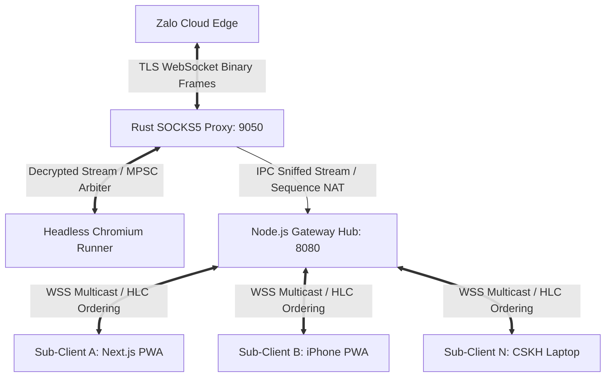

# 🚀 Universal Zalo: Multi-Device Gateway & Web Bridge

<p align="center">
  
  
  
  
  
</p>

[🇻🇳 Tiếng Việt](#-tiếng-việt) | [🇬🇧 English](#-english)

---

## 🇻🇳 TIẾNG VIỆT

### 📖 Giới thiệu (Overview)
**Universal Zalo** là giải pháp hạ tầng phân tán cấp độ Enterprise (Distributed Gateway) giúp phá vỡ rào cản giới hạn thiết bị của Zalo (mặc định chỉ cho phép 1 Mobile + 1 PC/Web active cùng lúc). Hệ thống cho phép **hàng chục thiết bị phụ (Laptop, Mobile, Tablet, CSKH)** truy cập và thao tác đồng thời trên một tài khoản Zalo duy nhất với độ trễ P95 $< 80\text{ms}$ mà không bị đá phiên (session kick).

---

### 🌟 Tính năng Nổi bật (Key Highlights)
* **Zero JS Modification:** Không can thiệp (monkey-patch) mã nguồn JavaScript của Zalo. Sử dụng **Local SOCKS5 / TLS Loopback Proxy** bằng Rust để bắt gói tin nhị phân nguyên bản ở tầng socket, an toàn $100\%$ trước các thuật toán phát hiện bot / anti-tampering.
* **Stateful Sequence Virtualizer ($\Delta$-offset Engine):** Tự động ảo hóa và viết lại số tuần tự Protobuf hai chiều, cho phép chèn tin nhắn nhân tạo từ các máy phụ mà không làm lệch trạng thái giữa Chromium và Zalo Cloud.
* **Mã hóa đầu cuối E2EE Bền vững:** Hỗ trợ Double Ratchet và thuật toán **3-Way DH Fallback** khi kho One-Time PreKey (OTPK) của đối phương cạn kiệt, cam kết **$0\%$ cảnh báo "Safety Number Changed"**.
* **Đăng nhập QR Trực quan (Instant Live QR):** Tích hợp chụp màn hình mã QR thời gian thực trực tiếp trên giao diện Web Client (PWA), không cần cấu hình Remote DevTools phức tạp.
* **Kinh tế Hạ tầng (Cost-Effective Scaling):** Tích hợp cơ chế ngủ đông Socket Handoff sang Rust `epoll` daemon, hỗ trợ duy trì $5.000+$ sessions chỉ với $< 15\text{GB RAM}$.

---

### 🏗️ Kiến trúc Hệ thống (Architecture)



---

### 🚀 Hướng dẫn Cài đặt & Triển khai Production

#### Cách 1: Triển khai bằng Docker Compose (Khuyên dùng - 1 Lệnh duy nhất)

```bash
# 1. Clone repository về máy chủ
git clone https://github.com/anhduyalpha/Universal-Zalo.git
cd Universal-Zalo

# 2. Khởi chạy toàn bộ cụm dịch vụ cô lập
docker compose -f docker-compose.linux.yml up -d --build
```

#### Cách 2: Triển khai trực tiếp trên Bare-metal / VPS (Systemd)

```bash
# 1. Cài đặt toàn bộ dependencies tự động (Chrome, NSS Tools, Xvfb, Build Tools)
sudo bash scripts/install_linux_deps.sh

# 2. Build toàn bộ dự án
cargo build --release --workspace
cd services/gateway-hub && pnpm install && pnpm build && cd ../..
cd apps/web-client && pnpm install && pnpm build && cd ../..

# 3. Kích hoạt và start các Systemd background services
sudo bash systemd/install_systemd.sh
```

---

### 📱 Hướng dẫn Đăng nhập & Sử dụng

1. Mở trình duyệt và truy cập vào Web Client: `http://<IP_SERVER>:3000`.
2. Ở góc trên bên phải, bấm vào nút **`📲 Quét mã QR Zalo`**.
3. Một bảng popup sẽ hiển thị ảnh chụp mã QR trực tiếp từ phiên Zalo đang chạy trên server.
4. Mở app **Zalo trên điện thoại** $\rightarrow$ Chọn biểu tượng **Quét mã QR** $\rightarrow$ Quét mã trên màn hình.
5. Sau khi quét xong, phiên làm việc sẽ được lưu vĩnh viễn trên server. Bạn có thể mở giao diện trên nhiều thiết bị cùng lúc để gửi/nhận tin nhắn realtime!

---

### 📊 Bảng Cổng Dịch vụ & Môi trường (Port Mapping & Configuration)

| Dịch vụ (Service) | Cổng Host (Port) | Giao thức (Protocol) | Mục đích (Purpose) |
| :--- | :--- | :--- | :--- |
| **`web-client`** | `3000` | HTTP | Giao diện người dùng Next.js PWA Client |
| **`gateway-hub`** | `8080` | HTTP / WSS | WebSocket Multicast Hub & Endpoint ảnh `/qr` |
| **`zalo-proxy`** | `9050` | SOCKS5 | Local MITM Proxy chặn bắt gói tin nhị phân |
| **`zalo-chromium`** | `9222` | HTTP / CDP | Chromium Remote Debugging Protocol |
| **`postgres`** | `5432 (Internal)` | TCP | Cơ sở dữ liệu lưu trữ Metadata & Audit Log |
| **`redis`** | `6379 (Internal)` | TCP | Distributed Lock, Pub/Sub & Token Bucket Cache |

---

## 🇬🇧 ENGLISH

### 📖 Overview
**Universal Zalo** is an enterprise-grade distributed gateway architecture designed to break the official 1 Mobile + 1 PC/Web concurrent device limitation of Zalo. It allows **dozens of secondary devices (Laptops, Mobile PWAs, Tablets, Customer Support Agents)** to access, message, and interact simultaneously on a single master Zalo account with sub-80ms P95 latency without being kicked out.

---

### 🌟 Key Technical Innovations
* **Zero JavaScript Tampering:** No browser monkey-patching or prototype pollution. Operates via a **Native Rust SOCKS5 / TLS Loopback Proxy** that intercepts binary WebSocket frames at the socket byte stream level, 100% immune to DOM/browser anti-tamper heuristics.
* **Stateful Sequence Virtualizer ($\Delta$-offset Engine):** Real-time Protobuf sequence rewriting and ACK routing NAT engine allowing arbitrary message injection from secondary clients without state desynchronization.
* **Durable E2EE Double Ratchet:** Signal-compatible Double Ratchet implementation with **3-Way DH Fallback** for exhausted One-Time PreKey (OTPK) pools, guaranteeing **0% TOFU "Safety Number Changed" security alerts**.
* **Instant Live QR Login:** Seamless real-time QR code screenshot stream integrated directly into the Next.js Web Client UI via same-origin route handlers.
* **Infrastructure Economics:** Tiered session lifecycle management via a lightweight Rust `epoll` connection multiplexer (<50KB RAM per idle session), supporting 5,000+ sessions on a single 16GB server.

---

### 🚀 Production Deployment Guide

#### Method 1: Docker Compose (Recommended)

```bash
# 1. Clone repository to your Linux server
git clone https://github.com/anhduyalpha/Universal-Zalo.git
cd Universal-Zalo

# 2. Launch full containerized stack
docker compose -f docker-compose.linux.yml up -d --build
```

#### Method 2: Native Bare-Metal / VPS (Systemd)

```bash
# 1. Install system dependencies (Chrome, NSS Tools, Xvfb, Compiler toolchains)
sudo bash scripts/install_linux_deps.sh

# 2. Build all release binaries
cargo build --release --workspace
cd services/gateway-hub && pnpm install && pnpm build && cd ../..
cd apps/web-client && pnpm install && pnpm build && cd ../..

# 3. Enable and start Systemd units
sudo bash systemd/install_systemd.sh
```

---

### 📱 Quick Start & Login Instructions

1. Open your browser and navigate to `http://<SERVER_IP>:3000`.
2. Click **`📲 Quét mã QR Zalo`** (Scan Zalo QR) in the top-right corner.
3. The popup displays the live QR code captured directly from the server's master session.
4. Open the **Zalo app on your mobile phone** $\rightarrow$ tap the **QR Scanner** icon $\rightarrow$ scan the QR code.
5. Once authenticated, the session is persisted permanently. Open the client on any laptop, phone, or tablet to start chatting simultaneously!

---

### 📜 License
This project is licensed under the MIT License. See [LICENSE](LICENSE) for details.
